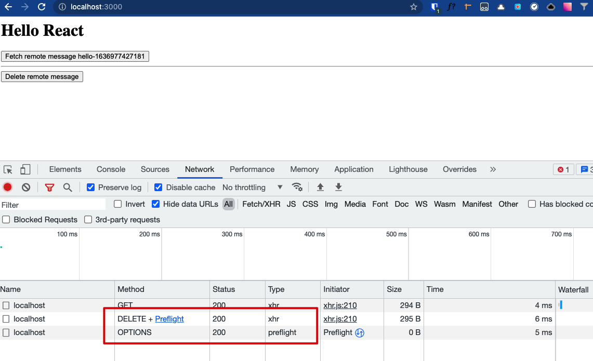

Java Spring Boot Handle Options Requests Demo
==============================

当声明了`@CrossOrigin`时， Spring boot会自动处理OPTIONS请求

```
npm i
npm run server
npm run client
```

然后点击页面上的"Delete Remote Message"按钮，可以在浏览器的Network里看到发送了OPTIONS请求，且成功处理


